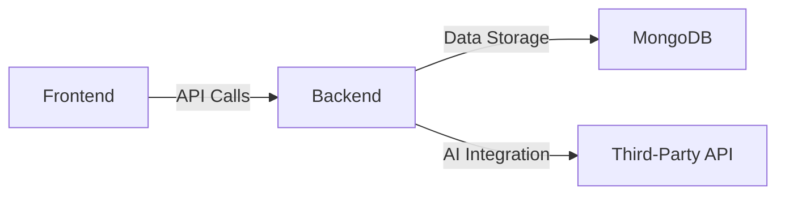
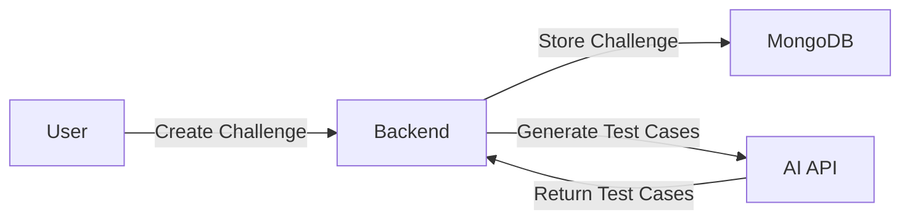

# CodeQuest Product Requirements Document

## Executive Summary
CodeQuest is a revolutionary platform designed to create and solve customized coding challenges with AI-powered test case generation and real-time feedback. The platform aims to cater to coding enthusiasts, educators, and companies looking to assess coding skills. By providing a user-friendly interface for creating challenges, leveraging AI for automated test case generation based on specified constraints, and delivering immediate feedback on code submissions, CodeQuest addresses key pain points in the coding education and assessment space. 

This platform revolutionizes traditional coding challenge systems by offering high levels of customization, reducing the time educators and companies spend on manual test case creation, and providing engaging, skill-building experiences for enthusiasts. Built with modern technologies like Express.js for the backend, Vite React for the frontend, MongoDB for data storage, and integrated with a third-party AI API, CodeQuest ensures scalability, reliability, and ease of use. The project is targeted for completion in a 1-week sprint, focusing on rapid development, testing, and deployment to capitalize on the growing demand in the coding education market.

## Market Analysis
The coding challenge market is rapidly growing, driven by the increasing demand for skilled programmers in industries such as software development, data science, and cybersecurity. With the rise of remote work and online education post-COVID, platforms that facilitate skill assessment and improvement have seen exponential adoption.

### Market Size and Growth
The global coding education market is expected to grow significantly over the next few years, projected to reach billions in value by 2030, driven by the increasing demand for skilled programmers. Factors such as the proliferation of coding bootcamps, corporate training programs, and interview preparation tools contribute to this expansion. CodeQuest is well-positioned to capture a significant share of this market by focusing on niche needs like AI-driven customization, which is underrepresented in current offerings.

### Competitive Landscape
Existing platforms, such as LeetCode, HackerRank, and Codewars, provide coding challenges but have notable limitations. These include restricted customization options for challenge creators, manual test case setup that is time-intensive, and delayed or limited feedback mechanisms. CodeQuest differentiates itself through AI-powered test case generation, which automates and enhances accuracy based on user-defined constraints, and real-time feedback that improves user engagement. This positions CodeQuest as a premium, efficient alternative for personalized coding experiences.

### Business Justification
CodeQuest generates revenue through subscription-based models tailored to user types: premium features for coding enthusiasts (e.g., unlimited challenges), tiered plans for educators (e.g., student tracking tools), and enterprise subscriptions for companies (e.g., bulk assessment features). The platform's unique value proposition—combining AI automation with customization—addresses unmet needs, leading to high user retention and word-of-mouth growth. With low development costs due to the 1-week implementation plan and scalable cloud deployment, the return on investment is projected to be strong in a market hungry for innovative coding tools.

## User Personas
CodeQuest targets three primary user groups, each with distinct needs, pain points, and behaviors. These personas are derived from market research and user feedback on similar platforms.

### Coding Enthusiasts
- **Name:** Alex
- **Age:** 25-35
- **Occupation:** Software Developer/Student
- **Needs:** Improve coding skills through diverse, personalized challenges; practice for job interviews; track progress over time.
- **Pain Points:** Limited access to customized coding challenges that match specific skill levels or topics; lack of immediate, detailed feedback to iterate quickly; generic platforms that don't adapt to individual learning styles.
- **Behavior:** Frequent users who solve challenges daily, value gamification elements, and seek community features in future iterations.

### Educators
- **Name:** Emma
- **Age:** 30-50
- **Occupation:** Teacher/Professor
- **Needs:** Create tailored coding assignments with specific constraints to assess student skills; automate grading and feedback; track class performance.
- **Pain Points:** Time-consuming manual creation of test cases and challenges; difficulty in providing consistent, immediate feedback to large groups; limited tools for integrating challenges into curricula.
- **Behavior:** Batch creators who design challenges in advance, prioritize ease of use, and require exportable reports for grading.

### Companies
- **Name:** Rachel
- **Age:** 30-50
- **Occupation:** HR/Recruiter
- **Needs:** Efficiently evaluate candidates' coding abilities through customizable challenges; integrate with hiring pipelines; generate reports on performance.
- **Pain Points:** Unreliable or generic assessment tools that don't align with company-specific tech stacks; challenges in scaling evaluations for high-volume recruitment; lack of AI assistance to ensure fair and varied testing.
- **Behavior:** High-stakes users who create challenges for interviews, value data privacy, and seek analytics on candidate benchmarks.

## Problem Landscape
Creating and solving coding challenges can be time-consuming and often lacks immediate feedback, hindering effective skill development and assessment. Existing platforms offer limited customization options, requiring users to adapt to predefined challenges rather than tailoring them to specific needs, such as particular algorithms, input formats, or difficulty levels. For educators and companies, manual test case generation is a bottleneck, leading to inconsistencies and delays. Coding enthusiasts struggle with platforms that don't provide real-time insights into errors or optimizations, reducing motivation. CodeQuest solves these by automating test case creation via AI, ensuring relevance to constraints, and delivering instant feedback to enhance learning and evaluation efficiency.

## Solution Architecture
CodeQuest employs a microservices-inspired architecture for modularity and scalability. The system is divided into core components that interact seamlessly to handle challenge creation, storage, AI integration, and user interactions. This design ensures low latency for real-time features and easy maintenance.

### System Components
1. **Frontend**: Vite React application responsible for the user interface and client-side logic. It handles rendering of challenge creation forms, code editors for submissions, and display of real-time feedback. Vite's fast build times enable rapid development and hot module replacement for a smooth developer experience.
2. **Backend**: Express.js server handling API requests, challenge creation, and submission processing. It acts as the central orchestrator, validating inputs, managing sessions, and routing data between the frontend, database, and AI services.
3. **Database**: MongoDB storing challenge data (e.g., constraints, test cases) and user submissions (e.g., code, results). Chosen for its flexibility with unstructured data like code snippets and scalability for growing user bases.
4. **AI Integration**: Third-party API for generating test cases based on challenge constraints. This service receives challenge details (e.g., input formats, edge cases) and returns comprehensive test suites, reducing manual effort.

### Technical Specifications
- **Backend**: Express.js (Node.js framework for RESTful APIs, chosen for its lightweight nature and extensive middleware ecosystem).
- **Frontend**: Vite React (Modern build tool with React for dynamic UIs, supporting fast reloads and component-based development).
- **Database**: MongoDB (NoSQL database for schema flexibility, ideal for storing varied challenge data).
- **AI Integration**: Third-party API (e.g., via HTTPS calls using Axios, with endpoints like `/generate-test-cases` for AI processing).
- **Additional Tech**: Axios for HTTP requests; Potential future expansions to support multiple languages via language-specific runners.

### Mermaid Diagrams
#### Application Architecture


#### Data Flow


#### User Interaction Flow
```mermaid
graph LR;
    A[User] -->|Submit Code|> B[Backend];
    B -->|Run Test Cases|> C[AI API];
    C -->|Return Results|> B;
    B -->|Display Feedback|> A;
```

## Feature Specifications
CodeQuest's features are designed to be intuitive, AI-enhanced, and focused on user needs. Each feature includes detailed use cases, constraints, and acceptance criteria to ensure robust implementation.

### Challenge Creation
- **Description**: Users can create coding challenges with customizable constraints (e.g., time limits, input/output formats) and input formats. The interface allows specifying problem statements, examples, and tags for categorization.
- **Use Cases**:
  - Educators creating assignments aligned with course topics.
  - Companies designing challenges for specific job roles (e.g., algorithmic efficiency for backend positions).
  - Coding enthusiasts crafting personal challenges for skill-building.
- **Constraints**:
  - Challenges must include mandatory fields like problem description and constraints to ensure completeness.
  - Stored securely in MongoDB with access controls for private vs. public challenges.
- **Acceptance Criteria**:
  - Users can input and save custom constraints via the UI.
  - Challenges are validated server-side before storage.
  - Retrieval and editing of existing challenges is supported.

### AI Test Case Generation
- **Description**: The platform automatically generates test cases based on the challenge constraints using a third-party AI API. This includes edge cases, random inputs, and performance tests.
- **Use Cases**:
  - Automating test setup for educators to save time.
  - Ensuring fair evaluations for companies by generating unbiased tests.
  - Providing varied practice for enthusiasts without manual input.
- **Constraints**:
  - Test cases must align strictly with provided constraints (e.g., input size limits).
  - API calls are rate-limited; fallback to basic templates if AI fails.
- **Acceptance Criteria**:
  - AI-generated tests are relevant and cover common/edge scenarios.
  - Integration handles API responses gracefully, storing tests in the database.

### Real-time Feedback
- **Description**: Users receive immediate feedback on code submissions, including pass/fail results, error messages, and suggestions for improvement.
- **Use Cases**:
  - Enthusiasts iterating on code during practice sessions.
  - Educators providing instant grading feedback.
  - Companies reviewing candidate submissions in real-time during interviews.
- **Constraints**:
  - Feedback must process within seconds to maintain "real-time" feel.
  - Secure execution of user code (e.g., in isolated environments).
- **Acceptance Criteria**:
  - Submissions trigger test runs with results displayed via WebSockets or polling.
  - Feedback includes detailed breakdowns (e.g., which tests failed and why).

## User Stories
1. As a coding enthusiast, I want to solve customized coding challenges so that I can improve my coding skills.
2. As an educator, I want to create coding challenges with specific constraints so that I can assess my students' skills effectively.
3. As a company, I want to use coding challenges to evaluate potential employees so that I can find the best talent.

## Implementation Tasks
### Backend Development
- Set up Express.js server.
- Implement API endpoints for challenge creation and submission.
- Integrate MongoDB for data storage.
- Integrate third-party API for AI test case generation.

### Frontend Development
- Set up Vite React application.
- Create UI for challenge creation and submission.
- Implement real-time feedback feature.

### Testing and Deployment
- Test the application thoroughly (unit, integration, end-to-end).
- Deploy the application on a cloud platform (e.g., Heroku, AWS).

## Implementation Plan
The implementation is structured as a 1-week sprint to ensure quick time-to-market while maintaining quality. Each phase builds on the previous, with daily check-ins for progress.

1. **Day 1-2: Backend Development**
   - Set up Express.js server with routing and middleware.
   - Implement API endpoints for challenge creation (`/create-challenge`) and submission (`/submit-code`).
   - Integrate MongoDB using Mongoose for schema definition and CRUD operations.

2. **Day 3-4: Frontend Development**
   - Set up Vite React application with components for forms and displays.
   - Create UI for challenge creation (forms for constraints) and submission (code editor integration, e.g., Monaco).
   - Implement client-side logic for API calls and real-time updates.

3. **Day 5: AI Integration and Testing**
   - Integrate third-party API for AI test case generation, including error handling.
   - Conduct thorough testing: unit tests for APIs, integration tests for data flow, and UI tests for user interactions.

4. **Day 6-7: Deployment and Final Testing**
   - Deploy the application to a cloud platform, configuring environment variables and scaling.
   - Perform final testing, debugging, and performance optimizations.

## Code Snippets
### Challenge Creation API Endpoint
```javascript
// Backend (Express.js)
app.post('/create-challenge', async (req, res) => {
    try {
        const challenge = new Challenge(req.body);
        await challenge.save();
        res.status(201).send(challenge);
    } catch (error) {
        res.status(400).send(error);
    }
});
```

### Real-time Feedback
```javascript
// Backend (Express.js)
app.post('/submit-code', async (req, res) => {
    try {
        const result = await runTestCases(req.body.code, req.body.challengeId);
        res.send(result);
    } catch (error) {
        res.status(500).send(error);
    }
});
```

### AI Test Case Generation
```javascript
// Backend (Express.js)
async function generateTestCases(challenge) {
    // Call third-party API to generate test cases based on challenge constraints
    const response = await axios.post('https://ai-api.com/generate-test-cases', challenge);
    return response.data;
}
```

## Edge Cases and Risk Assessments
1. **Invalid Challenge Constraints**: Users input malformed constraints (e.g., negative time limits), leading to AI failures or invalid tests.
2. **AI API Errors**: Downtime, rate limits, or incorrect responses from the third-party API disrupting test generation.
3. **Database Errors**: Connection failures, data corruption, or scalability issues with high user loads.
4. **Security Vulnerabilities**: User-submitted code executing maliciously or unauthorized access to challenges.
5. **Performance Bottlenecks**: Slow feedback due to complex tests or high traffic.

## Mitigation Strategies
1. **Robust Error Handling**: Implement validation middleware for inputs and graceful degradation (e.g., default test cases if AI fails).
2. **Retry Mechanisms**: Use exponential backoff for API calls to handle transient errors.
3. **Data Backup and Recovery**: Regular MongoDB backups and monitoring tools for database health.
4. **Security Measures**: Run code in sandboxed environments (e.g., Docker containers) and use authentication (JWT) for access.
5. **Performance Optimizations**: Caching for frequent queries, load balancing, and asynchronous processing for feedback.

## Success Metrics
1. **User Adoption**: Track sign-ups, active users, and retention rates (target: 20% month-over-month growth).
2. **User Engagement**: Measure challenges created/solved, session duration, and feedback ratings (target: 80% satisfaction).
3. **Customer Satisfaction**: Collect NPS scores via surveys (target: 8+ out of 10) and monitor churn rates.
4. **Technical Metrics**: Uptime (>99%), response times (<2s for feedback), and error rates (<1%).

## Resource Requirements
1. **Development Team**: 2-3 full-stack developers experienced in Node.js, React, and databases.
2. **Design Team**: 1 UI/UX designer for wireframes and user flows.
3. **DevOps Team**: 1 engineer for deployment, CI/CD pipelines, and monitoring.
4. **Tools**: Free/open-source (e.g., VS Code, GitHub) plus cloud credits for hosting.

## Timeline
The project timeline is estimated to be 7 days, with the following milestones:
1. **Day 1-2:** Backend Development complete.
2. **Day 3-4:** Frontend Development complete.
3. **Day 5:** AI Integration and initial testing done.
4. **Day 6-7:** Deployment, final testing, and launch readiness.

## Future Roadmap
- Integrate advanced AI features for automated challenge creation from natural language descriptions.
- Add support for multiple programming languages (e.g., Python, Java) with language-specific test runners.
- Introduce collaboration tools, such as shared challenges or leaderboards.
- Expand analytics dashboards for educators and companies.
- Mobile app integration for on-the-go challenge solving.

## Conclusion
CodeQuest stands as a transformative platform in the coding challenge ecosystem, bridging gaps in customization, automation, and feedback. By empowering coding enthusiasts to hone skills, educators to assess effectively, and companies to recruit talent efficiently, it meets critical market needs. With a solid architecture, detailed implementation plan, and focus on user-centric features, CodeQuest is set for success in a burgeoning market. This PRD serves as the blueprint for development, ensuring alignment across teams for a high-quality launch.
